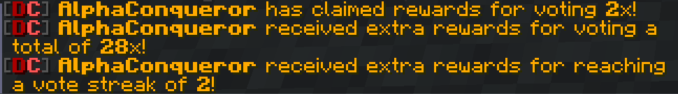
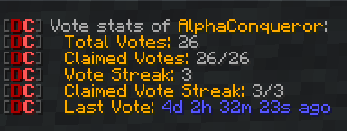

This is a sub-page of the main **Command Usage** page. [Click here to go back.](Command-Usage)

Key things to remember from the main page:

* Required arguments are marked with angle brackets - e.g. `<required>`
* Optional arguments are marked with square brackets - e.g. `[optional]`
* `...` - Argument consists of one or multiple words.
* All commands listed can also be used by typing **/dirtcore [command name]**.

___

### Index

* [/dirtcore [command name]](#dirtcore-command-name)
* [/vote](#vote)
* [/vote `claim`](#vote-claim)
* [/vote `stats` [target]](#vote-stats-target)

___

#### `/dirtcore [command name]`

**Permission**: n/a  
**Arguments**:

* `[command name]` - the command name

The main command of **DirtCore**. Enables the usage of all commands added by **DirtCore**.  
Typing **/dirtcore** will list all commands the command sender has permission to use.

Examples: `/dirtcore`, `/dirtcore ban AlphaConqueror`

___

#### `/vote`

**Permission**: dirtcore.vote

Displays a list of possible voting sites.

___

#### `/vote claim`

**Permission**: dirtcore.vote.claim

Claims the unclaimed vote rewards. These include:

* **default rewards**, as defined in the config entry `vote.claimed-rewards-extra-commands`
* **claimed votes extra rewards** for reaching a claimed vote milestone (e.g. every 10 votes users get something
  extra),  
  as defined in the config entry `vote.claimed-rewards-extra-commands`
* **streak extra rewards** for reaching a vote streak milestone (e.g. after voting 10 times in a row users get something
  extra),  
  as defined in the config entry `vote.streak-extra-reward-commands`

Claims will be broadcast in server chat.

No claim will be made if the user does not have enough inventory space.  
The inventory space per command is defined in
the config entry `vote.claim-free-inventory-space`.

This command can not be issued via console.

___

#### `/vote stats [target]`

**Permission**: dirtcore.vote.stats  
**Arguments**:

* `[target]` - the target user (**default**: command sender)

Displays the vote stats of `target`.

These stats include:

* **Total Votes**: the total amount of votes
* **Claimed Votes**: the amount of claimed vote rewards
* **Unclaimed Votes**: the amount of unclaimed vote rewards
* **Vote Streak**: the current vote streak
* **Claimed Vote Streak**: : the amount of claimed streak rewards
* **Last Vote**: the last time a vote has been registered

Example: `/vote stats AlphaConqueror`

___
