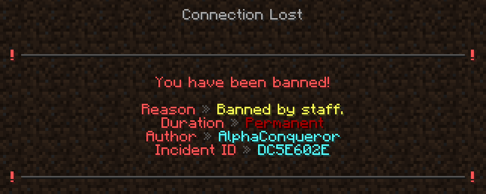
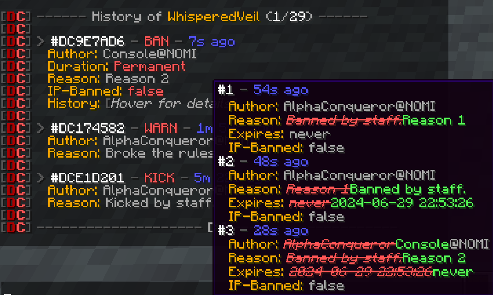
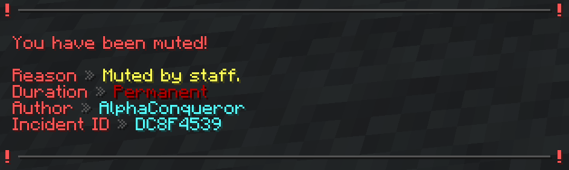
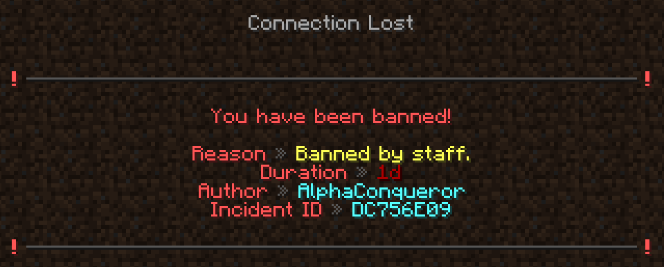
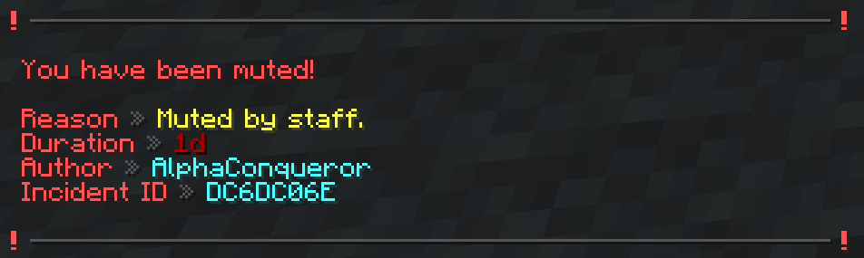
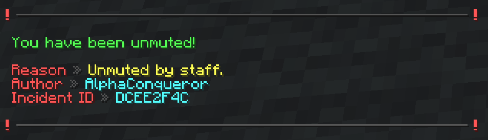
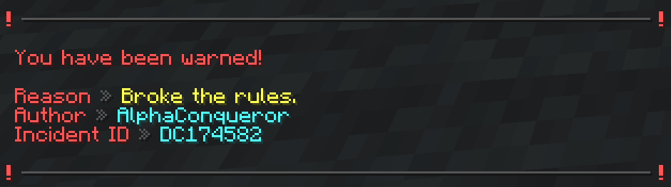

This is a sub-page of the main **Command Usage** page. [Click here to go back.](Command-Usage)

Key things to remember from the main page:

* Required arguments are marked with angle brackets - e.g. `<required>`
* Optional arguments are marked with square brackets - e.g. `[optional]`
* `...` - Argument consists of one or multiple words.
* All commands listed can also be used by typing **/dirtcore [command name]**.

___

### Index

* [/ban \<target\> [reason...]](#ban-target-reason)
* [/ban-ip \<target\> [reason...]](#ban-ip-target-reason)
* [/history \<target\> [reason...]](#history-target-page)
* [/kick \<target\> [reason...]](#kick-target-reason)
* [/mute \<target\> [reason...]](#mute-target-reason)
* [/tempban \<target\> \<time\> \<d|h|m|s\> [reason...]](#tempban-target-time-dhms-reason)
* [/tempmute \<target\> \<time\> \<d|h|m|s\> [reason...]](#tempmute-target-time-dhms-reason)
* [/unban \<target\> [reason...]](#unban-target-reason)
* [/unban-ip \<target\> [reason...]](#unban-ip-target-reason)
* [/unmute \<target\> [reason...]](#unmute-target-reason)
* [/warn \<target\> \<reason...\>](#warn-target-reason)

___

#### `/ban <target> [reason...]`

**Permission**: dirtcore.ban  
**Arguments**:

* `<target>` - the target user
* `[reason...]` - the reason (**default**: *Banned by staff.*)

Bans `target` from the network for `reason`.

Examples: `/ban AlphaConqueror`, `/ban AlphaConqueror Broke the rules.`

Related: [Ban](Punishments#ban)

___

#### `/ban-ip <target> [reason...]`

**Permission**: dirtcore.banip  
**Arguments**:

* `<target>` - the target user
* `[reason...]` - the reason for the IP ban escalation

Marks the current ban of `target` as an IP ban. IP bans should only be used to escalate bans due to the risk of ban
evasion. If no `reason` is provided, the reason will not be updated.

Examples: `/ban-ip AlphaConqueror`, `/ban-ip AlphaConqueror Ban evasion.`

Related: [IP Ban](Punishments#ip-ban)

___

#### `/history <target> [page]`

**Permission**: dirtcore.history  
**Arguments**:

* `<target>` - the target user
* `[page]` - the reason (**min**: 1)

Displays the punishment history of `target` on `page`.

Examples: `/history AlphaConqueror`, `/history AlphaConqueror 5`

___

#### `/kick <target> [reason...]`

**Permission**: dirtcore.kick  
**Arguments**:

* `<target>` - the target user
* `[reason...]` - the reason (**default**: *Kicked by staff.*)

Kicks `target` from the network for `reason`.

Examples: `/kick AlphaConqueror`, `/kick AlphaConqueror Broke the rules.`

Related: [Kick](Punishments#kick)

___

#### `/mute <target> [reason...]`

**Permission**: dirtcore.mute  
**Arguments**:

* `<target>` - the target user
* `[reason...]` - the reason (**default**: *Muted by staff.*)

Mutes `target` for `reason`.

Examples: `/mute AlphaConqueror`, `/mute AlphaConqueror Broke the rules.`

Related: [Mute](Punishments#mute)

___

#### `/tempban <target> <time> <d|h|m|s> [reason...]`

**Permission**: dirtcore.tempban  
**Arguments**:

* `<target>` - the target user
* `<time>` - the target user (**min**: 1)
* `<d|h|m|s>` - the time unit (**d**: days, **h**: hours, **m**: minutes, **s**: seconds)
* `[reason...]` - the reason (**default**: *Banned by staff.*)

Temporarily bans `target` from the network for `time` `d|h|m|s` for `reason`.

Examples: `/tempban AlphaConqueror 1 d`, `/tempban AlphaConqueror 30 d Broke the rules.`

Related: [Ban](Punishments#ban)

___

#### `/tempmute <target> <time> <d|h|m|s> [reason...]`

**Permission**: dirtcore.tempmute  
**Arguments**:

* `<target>` - the target user
* `<time>` - the target user (**min**: 1)
* `<d|h|m|s>` - the time unit (**d**: days, **h**: hours, **m**: minutes, **s**: seconds)
* `[reason...]` - the reason (**default**: *Banned by staff.*)

Temporarily mutes `target` for `time` `d|h|m|s` for `reason`.

Examples: `/tempmute AlphaConqueror 1 d`, `/tempmute AlphaConqueror 30 d Broke the rules.`

Related: [Mute](Punishments#mute)

___

#### `/unban <target> [reason...]`

**Permission**: dirtcore.unban  
**Arguments**:

* `<target>` - the target user
* `[reason...]` - the reason (**default**: *Unbanned by staff.*)

Unbans `target` from the network for `reason`.

Examples: `/unban AlphaConqueror`, `/unban AlphaConqueror Appeal has been accepted.`

Related: [Unban](Punishments#unban)

___

#### `/unban-ip <target> [reason...]`

**Permission**: dirtcore.unbanip  
**Arguments**:

* `<target>` - the target user
* `[reason...]` - the reason for the IP ban de-escalation

Marks the current ban of `target` as a non-IP ban. If no `reason` is provided, the reason will not be updated.

Examples: `/unban-ip AlphaConqueror`, `/unban-ip AlphaConqueror Appeal has been accepted.`

Related: [IP Unban](Punishments#ip-unban)

___

#### `/unmute <target> [reason...]`

**Permission**: dirtcore.unmute  
**Arguments**:

* `<target>` - the target user
* `[reason...]` - the reason (**default**: *Unmuted by staff.*)

Unmutes `target` for `reason`.

Examples: `/unmute AlphaConqueror`, `/unmute AlphaConqueror Appeal has been accepted.`

Related: [Unmute](Punishments#unmute)

___

#### `/warn <target> <reason...>`

**Permission**: dirtcore.warn  
**Arguments**:

* `<target>` - the target user
* `<reason...>` - the reason

Warns `target` for `reason`.

Examples: `/warn AlphaConqueror Broke the rules.`

Related: [Warn](Punishments#warn)

___
